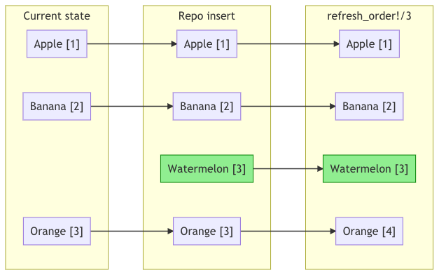
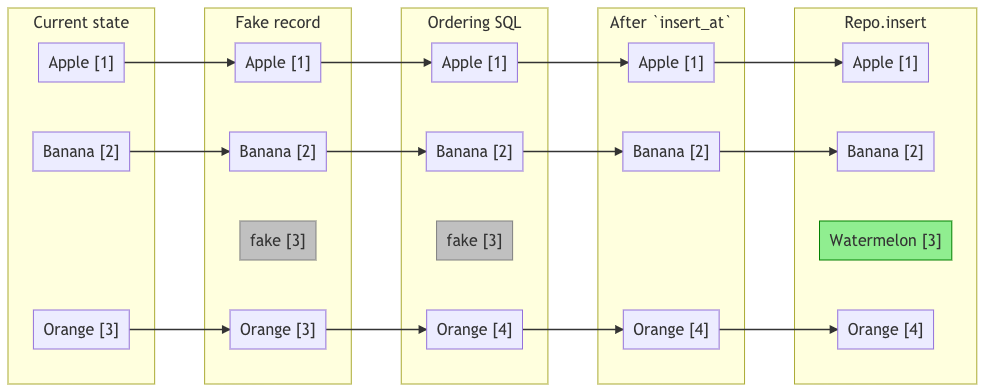

# Positioner

Positioner is a library that tries to utilize PostgreSQL window functions to provide the user
with the ability to store ordered collections in database and keep their order in sync with changes made on that collection.

## Install

Add `positioner` to your `mix.exs`

```elixir
def deps do
  [
    {:positioner, "~> 0.1.4"}
  ]
end
```

Let the positioner know which `Repo` to use in your `config/config.exs`

```elixir
config :positioner, repo: MyApp.Repo
```

## Terminology used

* `Dummy` - an example model that we want to be ordered
* `Tenant` - an object associated with `Dummy` that acts as a resource owner
* `Collection` - a set or records that can be treated as one group
* `Scope` - columns that define the collection grouping and is the shared by all records in collection
* `position column` - a column that holds the given record position in a collection

## Using through changeset

`Positioner` provides you with a helper method that will figure out what action need to be taken based on your changeset. All you need to do is call `Positioner.Changeset.set_order/3`
passing it the `changeset`, `position_column` and a list of `scopes`.

This helper will call `Ecto.Changeset.prepare_changes` to register a callback that will be run before you execute the changeset with your `Repo`. This callback will execute a SQL query that will update other records in a collection so their position matches the changes that will be made by changeset.

**Important:** as with any callback, you must be careful when doing actions like bulk inserts that will prepare many changesets with `set_order` call in them and then execute them in a loop. Each such call will cause an additional SQL update query. That is why you might consider using `Positioner` lower level API

```elixir
def create_changeset(model, tenant, params) do
  model
  |> cast(params, [:position])
  |> put_change(:tenant_id, tenant.id)
  |> Positioner.Changeset.set_order(:position, [:tenant_id])
end
```

```elixir
def update_changeset(model, _tenant, params) do
  model
  |> cast(params, [:title, :position, :tenant_id])
  |> Positioner.Changeset.set_order(:position, [:tenant_id])
end
```

```elixir
def delete_changeset(model) do
  model |> change() |> Positioner.Changeset.set_order(:position, [:tenant_id])
end
```

## Using directly

There are few methods that will give you a better control over when and what changes will be made to your collection.

### Refresh Order

`refresh_order` - Refresh order is a method to be used after you made changes to the collection that resulted in broken ordering. This can be either adding a new record at already occupied position or removing a record and creating a hole in ordering.

Refresh order will fix the ordering, removing all the holes and resolving conflicing position.
Conflicts are resolved by giving priority to records that were updated more recently (`update_at` column) and if the date is the same by ordering them by `id`.

```elixir
Positioner.refresh_order!(Dummy, [tenant_id: tenant_id], :position)
```

### Update positions

`update_positions` - is a method used when you want to reorder the whole collection. It expects you to pass an ordered list with record ids. All records that belong to the collection yet do not appear in the list will be moved to the end of the collection, while preserving their order.

```elixir
Positioner.update_positions!(Dummy, [tenant_id: tenant_id], :position, [d3, d4, d2, d1])
```

### Appending record to the collection

`position_for_new` - is a method that returns you a position at which your new record should be inserted. It is equal to the `max` position of the collection incremented by 1

```elixir
Positioner.position_for_new(Dummy, [tenant_id: tenant_id], :position)
```

### Insert At

`insert_at` - prepares your collection for a new record at given position. It will make sure that no record occupy this `position` and will move records by one position if necessary.

```elixir
Positioner.insert_at(Dummy, [tenant_id: tenant_id], :position, 3)
```

### Update To

`update_to` - readjusts the collection as if the record with given `id` was moved from passed position to another.

**Note:** You are required to pass the `current_position` because depending on wether you move past or before it determines what action need to be taken. We might be able to get rid of this params from method definition if we manage to translate the logic to operate directly on a column holding `current_position`.

```elixir
Positioner.update_to(Dummy, [tenant_id: tenant_id], :position, 3, 2, id)
```

### Delete

`delete` - squashes collection positions as if the record with given `id` was deleted (will result decrementing positions of some records and another record will also hold the position of the record to be deleted)

```elixir
Positioner.delete(Dummy, [tenant_id: tenant_id], :position, to_be_removed_id)
```

## How it works

Postgres have a functionality of assigning a row number to each record in a query result.
We try to use this to order our collections. Every time we want to update our collection order
we fetch all records, give the results a `row_number` and check if the records hold the positions they are supposed to, if not we update them to the `expected position`.

If we want to change the collection there are now two ways to keep it in order.

For example if we want to insert a new record we can either:

* just put the record at coliding position and our row numbering SQL to readjust the collection
* we can pretend that the change was already made, adjust the collection with that assumption in mind and then actually insert the record at that position

The former option is equal to doing `Repo.insert` and calling `Positioner.refresh_order!`
while the latter is what `Positioner.Changeset` does or what you can do by calling `Positioner.insert_at` followed by `Repo.insert`

### Visualizations

`Repo.insert` + `refresh_order!`



`insert_at` + `Repo.insert`



## TODO

* [ ] Reorder arguments order so it default arguments are not in the middle of the method definition.
* [ ] Smarter scopes in changeset helper so you can pass assoc name instead of column name. For example `put_assoc(changeset, :tennant, tenant)` with a scope on `tenant_id` will fail as `put_assoc` will not set `tenant_id` in a changeset.
